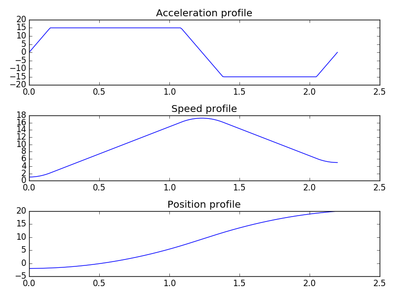
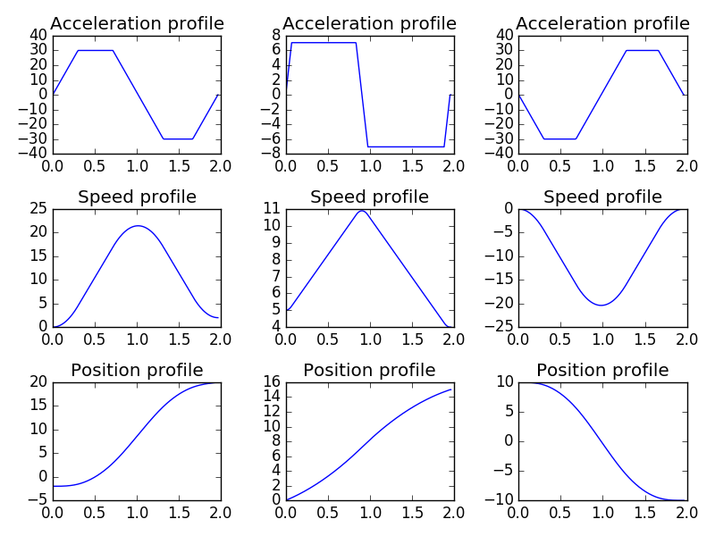
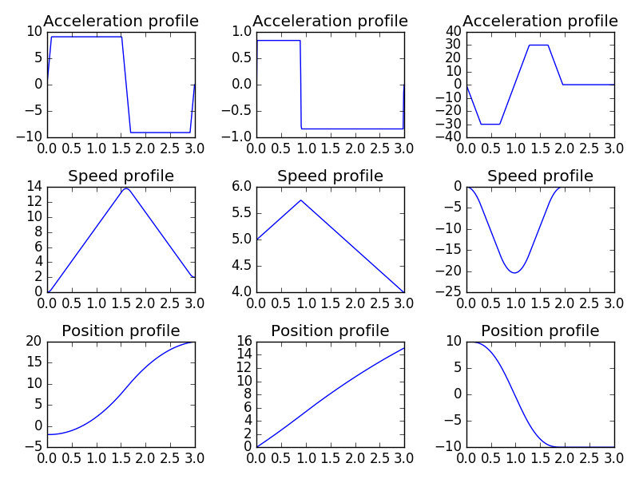

# PyScurve

Small library for planning scurve velocity profiles. The crucial part of implementaion is based on "Trajectory Planning for Automatic Machines and Robots-Springer (2008)" by Luigi Biagiotti, Claudio Melchiorri.

# Installation
Installation is pretty simple. Firstly clone repository:
```sh
git clone https://github.com/nameofuser1/py-scurve.git
cd py-scurve
```
and then run installation script:
```sh
python setup.py install
```

# Examples
```python
from pyscurve import ScurvePlanner, plot_trajectory

if __name__ == "__main__":
    q0 = [-2.]
    q1 = [20.]
    v0 = [1.]
    v1 = [5.]
    v_max = 20.
    a_max = 15.
    j_max = 100.

    p = ScurvePlanner()
    tr = p.plan_trajectory(q0, q1, v0, v1, v_max, a_max, j_max)
    plot_trajectory(tr, 0.01)
```



Trajectories for several DOFs are automatically synchronized:
```python
from pyscurve import ScurvePlanner
from pyscurve import plot_trajectory

if __name__ == "__main__":
    q0 = [-2., 0., 10.]
    q1 = [20., 15., -10.]
    v0 = [0., 5., 0.]
    v1 = [2, 4., 0.]
    v_max = 30.
    a_max = 30.
    j_max = 100.
    T = None

    p = ScurvePlanner()

    tr = p.plan_trajectory(q0, q1, v0, v1, v_max, a_max, j_max, t=T)
    plot_trajectory(tr, dt=0.01)
```



Specify parameter T in order to fit all the trajectories in the same execution time:
```python
from pyscurve import ScurvePlanner
from pyscurve import plot_trajectory

if __name__ == "__main__":
    q0 = [-2., 0., 10.]
    q1 = [20., 15., -10.]
    v0 = [0., 5., 0.]
    v1 = [2, 4., 0.]
    v_max = 30.
    a_max = 30.
    j_max = 100.
    T = 3.0

    p = ScurvePlanner()

    tr = p.plan_trajectory(q0, q1, v0, v1, v_max, a_max, j_max, t=T)
    plot_trajectory(tr, dt=0.01)
```


# Synchronization
Just to make it clear. If trajectory final speed is **0** then it is **NOT** synchronized in time with others and minimum time trajectory is computed. all trajectories with non-zero final velocities are fitted in the same time because non-zero final speed will introduce unwanted displacement if trajectories are not synchronized. Same is true for constant time trajectories(possibly not a good approach for constant time trajectory, will fix it in future builds).

License
----

MIT
